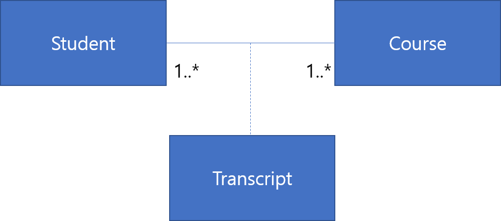
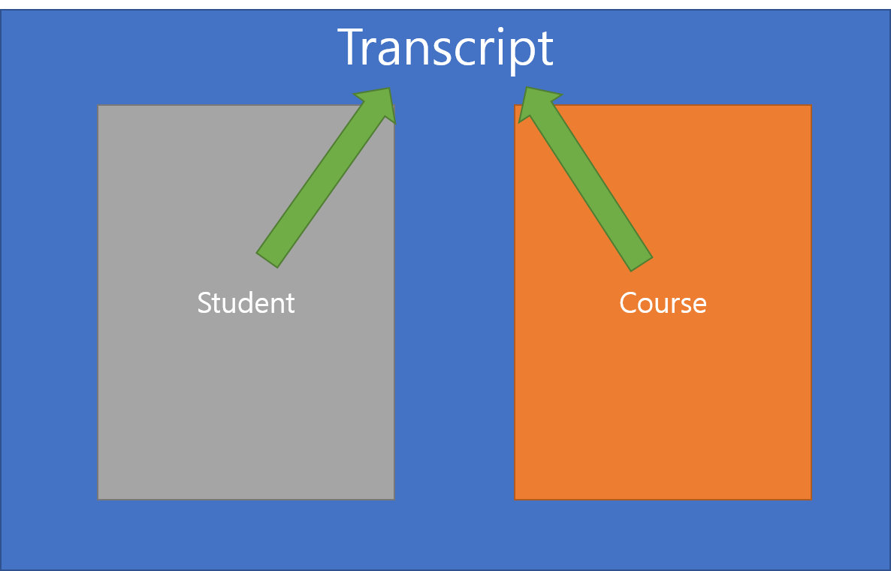

# ArrayList 연습
###### JAVA 객체 지향 디자인 패턴 p44

## 새롭게 배운 내용

#### 1. 연관 클래스를 이용해 Student Class와 Course Class를 매개해주는 클래스(Transcript)를 하나 만들었음, 이를 연관클래스라고 한다. Transcript 클래스에는 Student와 Course 클래스의 객체를 선언한다. Student와 Class를 포함할 수 있는 컨테이너라고 생각하면 편할 것 같다. 연관클래스를 쓰면 좋은 점이 Student와 Course를 정리할 수 있다는 것이다. 이는 아래에서 설명하겠다. 연관클래스를 그림으로 표현하면 다음과 같다.



#### 2. 매개해준 클래스의 객체를 받아 ArrayList에 넣는 방법이 인상적임
 > ##### Student 클래스
 ```java
public class Student {
  public void addTranscriptToList(Transcript transcript){
		list.add(transcript);
	}
}
```
 > ##### Transcript 클래스
```java
public class Transcript {
	private Student student;
  public Transcript(Student student, Course course){
  		this.student = student;
  		this.student.addTranscriptToList(this);
  	}
  }
  ```

#### 3. 특정 학생이 들은 수업의 리스트를 뽑는 과정
```java
public class Student {
  public void addTranscriptToList(Transcript transcript){
		list.add(transcript);
	}

  public ArrayList<Course> getCoursesfromStd(){
		ArrayList<Course> courses = new ArrayList<>(); //Course 객체를 담을 ArrayList를 만들고
		Iterator<Transcript> itor = list.iterator(); //Student 객체의 ArrayList에 저장된 Transcript 객체를 Iterator에 넘겨줌

		while(itor.hasNext()){
			Transcript tr = itor.next(); //itor에 있는 Transcript 객체를 또다른 Transcript 변수에 담아줌
			courses.add(tr.getCourse());
		}		
		//위의 식을 Iterator를 안쓰고 아래처럼 쓸수도 있다.		
		for(Transcript tr : list){			
			courses.add(tr.getCourse());			
		}

		return courses;
	}
}
```
```java
public class Transcript {
	private Student student;
  public Transcript(Student student, Course course){
		this.student = student;
		this.student.addTranscriptToList(this); 		
	}
  public Course getCourse() {
		return course;
	}
}
```
```java
public class MainSchool {

	public static void main(String[] args) {
        Student s1 = new Student("Insup");
		Course se = new Course("Software Engineering");
		Course ma = new Course("Math");
		Course ko = new Course("Korean");		

    Transcript t1 = new Transcript(s1, se); //객체를 생성하는 과정 만으로도 Student와 Course의 ArrayList에 이 Transcript 객체가 저장된다.
		t1.setGrade("A+");

    ArrayList<Course> courselist;
		courselist = s1.getCoursesfromStd();

		for(Course course : courselist){
			System.out.println(course.getSubject());
		}
  }
}
```

##### Transcript 생성자에서 받은 Student, Course 객체는 각자의 ArrayList 객체에 Transcript 객체를 저장한다.
```java
Transcript t1 = new Transcript(s1, se);
Transcript t2 = new Transcript(s1, ma);
Transcript t3 = new Transcript(s1, ko);
```
##### 이렇게 하면 s1의 ArrayList에 t1, t2, t3 저장되고 그 안에 있는 Course 객체인 se, ma, ko도 함께 저장됨
```java
public class Transcript {
	private Student student;
  public Transcript(Student student, Course course){
		this.student = student;
		this.student.addTranscriptToList(this); 		
	}
  ```

```java
public class Student {
  public void addTranscriptToList(Transcript transcript){
		list.add(transcript);
	}
}
```
